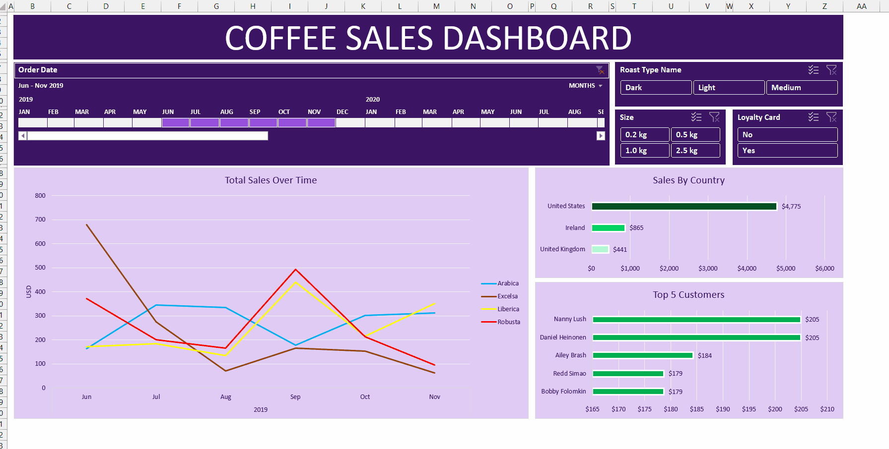

# ☕ Coffee Sales Dashboard


An interactive Excel dashboard built to analyze coffee sales across regions, customer segments, and bean types. The dashboard enables stakeholders to explore customer trends, product performance, and seasonal sales patterns using intuitive filters.

---

## 🎯 Objective

To design a visually rich and user-friendly Excel dashboard for business stakeholders to:
- Track sales by product type and time
- Filter based on roast type, coffee size, and loyalty status
- Identify top-performing customers and countries

---

## 🛠 Tools & Technologies

- **Microsoft Excel** (Pivot Tables, Slicers, Charts)
- **Power Query** (for preprocessing, if used)
- **Git & GitHub** (for versioning and documentation)

---

## 📂 Project Structure

```bash
coffee-sales-dashboard/
├── data/ → Source data file (.csv or .xlsx)
├── excel_dashboard/ → Final dashboard file
├── visuals/ → GIF preview and screenshots
├── README.md → Project documentation
└── .gitignore
```

---


---

## 📊 Key Dashboard Features

- **📅 Date Filter**: Monthly slicer from June 2019 to Nov 2020
- **☕ Roast Type Selector**: Filter by Dark, Medium, or Light
- **⚖️ Size Selector**: Choose between 0.2kg, 0.5kg, 1kg, 2.5kg packs
- **💳 Loyalty Filter**: Segment customers by loyalty card status
- **🌎 Sales by Country**: Visualize sales across regions
- **👥 Top 5 Customers**: Identify best-performing buyers
- **📈 Sales Trend**: Line chart showing total sales over time by bean type

---

## 🎥 Dashboard Preview



---

## 💡 Insights

- **Arabica** and **Robusta** dominate overall sales volumes
- Majority of sales come from **United States**
- Loyal customers contribute significantly to consistent revenue
- Monthly sales fluctuate with clear trends around certain roast types and sizes

---

## 🧠 Author

**Gokula Krishnan**  
[LinkedIn](https://www.linkedin.com/in/your-link) | [Portfolio](https://your-portfolio-link)

---

## 📜 License

This project is licensed under the [MIT License](LICENSE).
